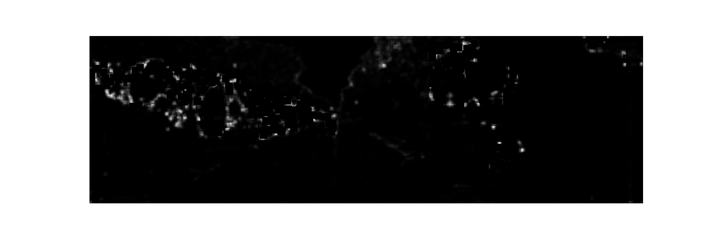
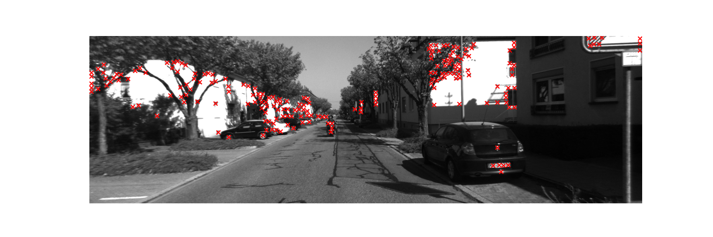
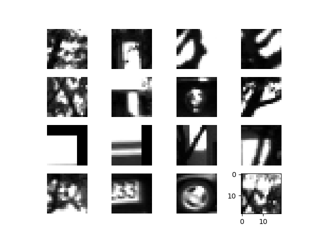
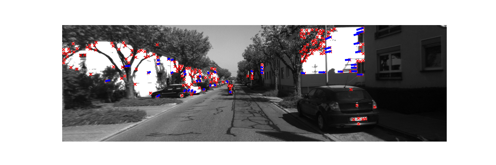

# Simple KeyPoint Tracker

The goal of this exercise is to build a simple Key-point Detector and Tracker. This helps to familiarize with concepts like Feature Detection, Feature Description, Feature Matching and Tracking.

## Feature Detection

Consider the original image:

Applying the corner response function on the above image,

Selecting the Keypoints (corners) using the above responses,

## Feature Description

16 Patch-Based Descriptors with the highest response scores,

## Feature Matching and Tracking

Feature Matching between two consecutive frames,

## KeyPoint Detection and Tracking

