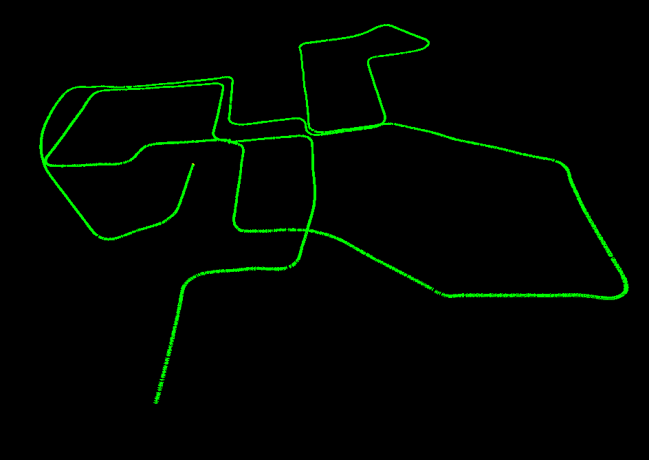

# Visual Odometry

This project is an implementation of a simple Visual Odometry pipeline.

## Requirements

* Python 3.6+
* numpy
* cv2
* [g2o](https://github.com/uoip/g2opy) for optimization
* [pangolin](https://github.com/uoip/pangolin) for visualization

## Usage

`python main.py`

## Results

### TODO

* Work on Loop Closure
* Exhaustive evaluation on datasets.